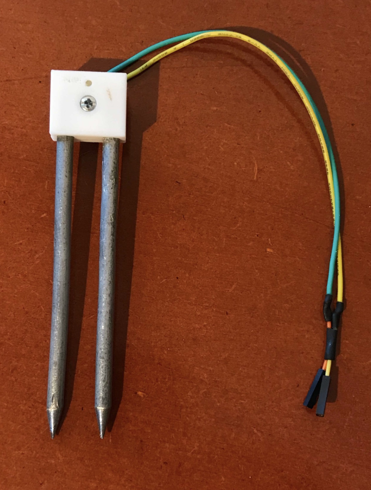

## Box for your offzen plantfeeder

Slice the plantfeeder.stl and print with PLA. Infill set to 40% or higher and you should be good.

* I added a flyback diode over the motor
* I added a resistor on the base of the TIP31C to limit currents.
* I have moved the terminal block more to the left to give the TIP31C more room

## Waterguide for your offzen plantfeeder

Slice the waterguide.stl and print with PLA, use a brim of 4mm use support for the sprout. CLean it up after printing.

## New probe for your offzen plantfeeder

The soilProbe started to oxidize very quickly and I found it very sensitive.
This probe sticks much deeper in the soil making it much more sturdy and less sensitive.
Your A/D values will also be much lower (mine where like 100 for a wet soil instead of 300..400).
You properly want to modify the SCAD file before you print it to match the probe diameter (`probeDiam` in scad file)you have.
Mine where 6mm in diameter and I could solder them very easy. Perhaps some kopper wire you might have? 
Just print them with 100% infill and use a 3mm screw to put it together.

