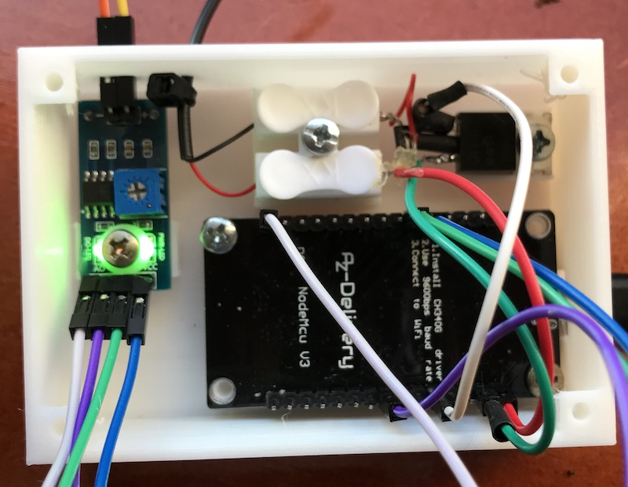

## Box for your offzen platfeeder

Slice the plantfeeder.stl and print with PLA. Infill set to 40% or higher and you should be good.

* I added a flyback diode over the motor
* I added a resistor on the base of the TIP31C to limit currents.
* I have moved the terminal block more to the left to give the TIP31C more room

## Waterguide for your offzen platfeeder

Slice the waterguide.stl and print with PLA, use a brim of 4mm use support for the sprout. CLean it up after printing.

